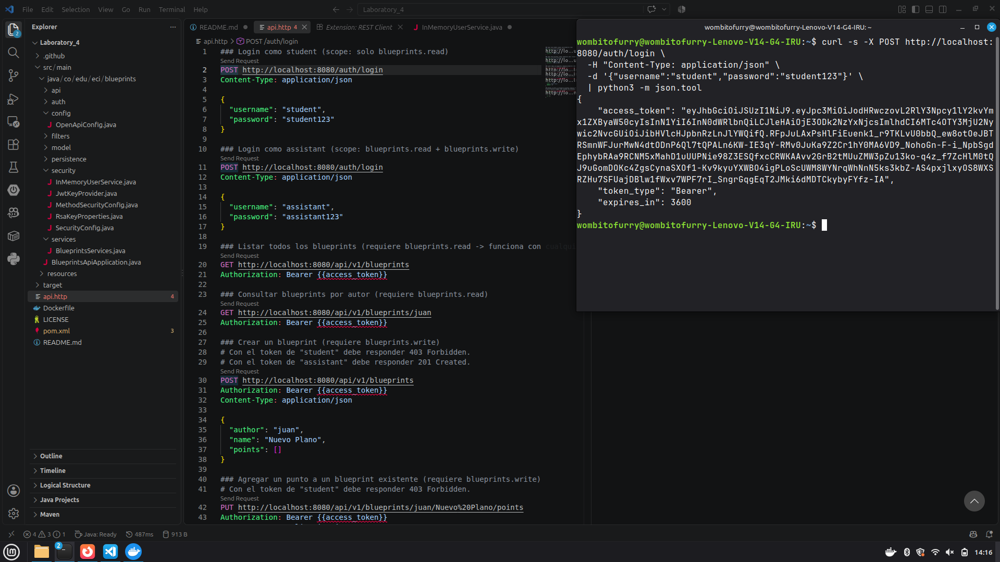
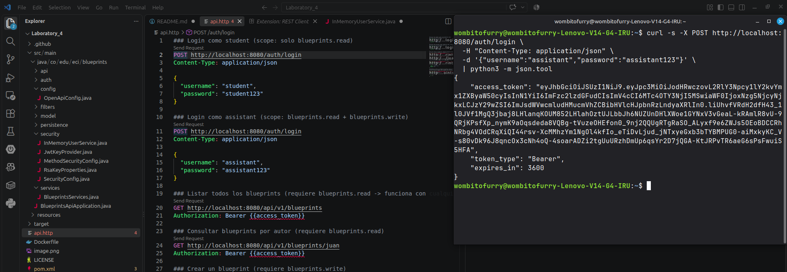
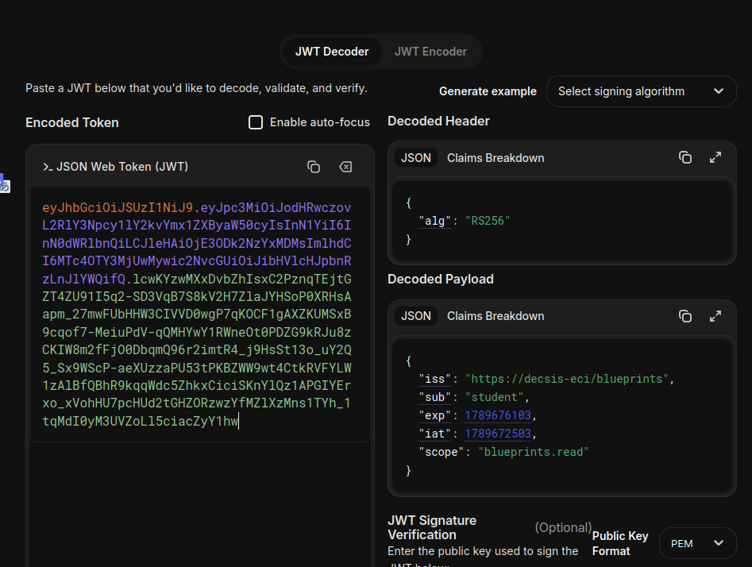
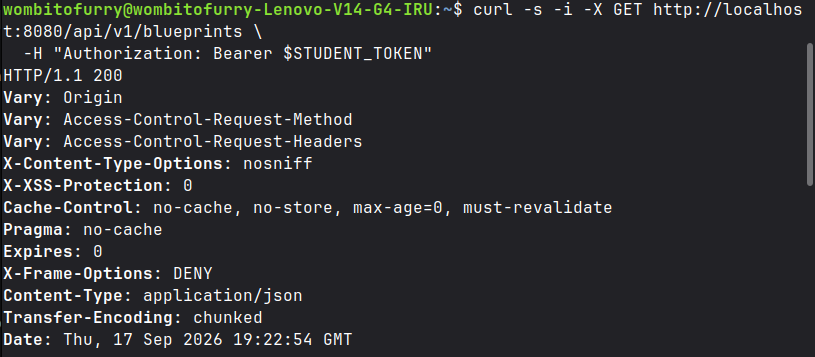
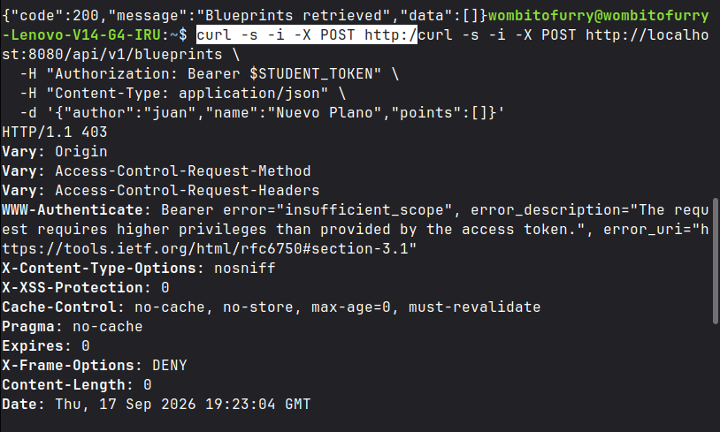
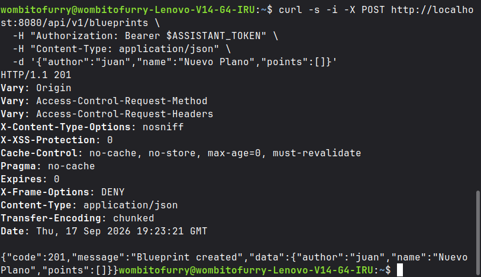

# Escuela Colombiana de Ingeniería Julio Garavito
## Arquitectura de Software – ARSW
### Laboratorio – Parte 2: BluePrints API con Seguridad JWT (OAuth 2.0)
## Julio Mayorquin y Diego Patiño
## Evidencia y respuestas — Actividades 1, 2 y 3

### 1. Configuración de seguridad (`SecurityConfig`)

`SecurityConfig` define las reglas de autorización en `securityFilterChain` así:

| Ruta | Regla | Tipo |
|---|---|---|
| `/actuator/health`, `/auth/login` | `permitAll()` | Pública |
| `/v3/api-docs/**`, `/swagger-ui/**`, `/swagger-ui.html` | `permitAll()` | Pública (documentación) |
| `/api/**` | `hasAnyAuthority("SCOPE_blueprints.read", "SCOPE_blueprints.write")` | Protegida — exige al menos uno de los dos scopes |
| Cualquier otra | `authenticated()` | Protegida — exige solo estar autenticado |

Además, `oauth2ResourceServer(oauth2 -> oauth2.jwt(...))` habilita el API como *Resource Server*, validando cada `Authorization: Bearer <token>` contra el `JwtDecoder` (llave pública RSA generada en `JwtKeyProvider`). El control fino de *qué* scope exige *cada* endpoint no vive aquí, sino en las anotaciones `@PreAuthorize` de los controllers (ver actividad 3).

### 2. Flujo de login y claims del JWT

`POST /auth/login` valida credenciales contra `InMemoryUserService` (BCrypt) y, si son válidas, emite un JWT firmado con RS256 vía `JwtEncoder`. Las claims emitidas son:

- `iss`: `https://decsis-eci/blueprints`
- `iat` / `exp`: emisión y expiración (TTL configurable en `application.yml`, 3600s por defecto)
- `sub`: el username
- `scope`: string separado por espacios — Spring Security lo traduce automáticamente en authorities con prefijo `SCOPE_`

Como mejora sobre el enunciado, se diferenciaron los scopes por usuario en `InMemoryUserService.scopesFor(username)`:
- `student` → `blueprints.read` (solo lectura)
- `assistant` → `blueprints.read blueprints.write` (lectura y escritura)

Esto permite comprobar en la práctica que el scope emitido en el token sí determina qué puede hacer cada usuario, en vez de que todos reciban los mismos permisos.

**Capturas sugeridas:**

Respuesta de POST /auth/login con el usuario student: se emite un JWT firmado en RS256, válido por 3600 segundos.

Respuesta de POST /auth/login con el usuario assistant: se emite un JWT distinto, con permisos diferentes al de student.

Payload del token de student decodificado en jwt.io: el claim scope solo contiene blueprints.read.

### 3. Extensión de scopes a los endpoints de P1

Se integró `BlueprintsAPIController` (con su modelo, persistencia Postgres y capa de servicios) traído del laboratorio P1, y se protegió cada endpoint según su naturaleza:

| Endpoint | Scope requerido |
|---|---|
| `GET /api/v1/blueprints` | `blueprints.read` |
| `GET /api/v1/blueprints/{author}` | `blueprints.read` |
| `GET /api/v1/blueprints/{author}/{bpname}` | `blueprints.read` |
| `POST /api/v1/blueprints` | `blueprints.write` |
| `PUT /api/v1/blueprints/{author}/{bpname}/points` | `blueprints.write` |

GET /api/v1/blueprints con el token de student responde 200 OK: el scope blueprints.read sí permite consultar.

POST /api/v1/blueprints con el token de student responde 403 Forbidden: sin scope blueprints.write, la escritura queda bloqueada.

POST /api/v1/blueprints con el token de assistant responde 201 Created: con scope blueprints.write, la creación sí se autoriza.

### 4. Tiempo de expiracion del token

Se probo el token con un tiempo de expiracion de 30 segundos usando la variable de entorno `BLUEPRINTS_SECURITY_TOKEN_TTL_SECONDS=30`.

Resultado: el token siguio funcionando hasta cerca de 90 segundos. Esto pasa porque Spring da por defecto 60 segundos de margen de reloj al validar la expiracion.

Se agrego la propiedad `blueprints.security.clock-skew-seconds` en `application.yml` (por defecto 60) para poder cambiar ese margen. Con el margen en 0 el token vence justo a los 30 segundos y la API responde 401 con el mensaje `Jwt expired`.

### 5. Documentacion en Swagger

Swagger UI queda en `http://localhost:8080/swagger-ui/index.html`.

Se documento `POST /auth/login` con su descripcion, ejemplos de entrada y las respuestas 200 y 401. Se marco como publico para que no aparezca con candado en Swagger.

En los endpoints de `/api/v1/blueprints` se agrego el scope que pide cada uno y las respuestas 401 (token invalido o vencido) y 403 (el token no tiene el scope necesario).

Para probar en Swagger: hacer login, copiar el `access_token`, darle a Authorize y pegar el token sin la palabra Bearer.
